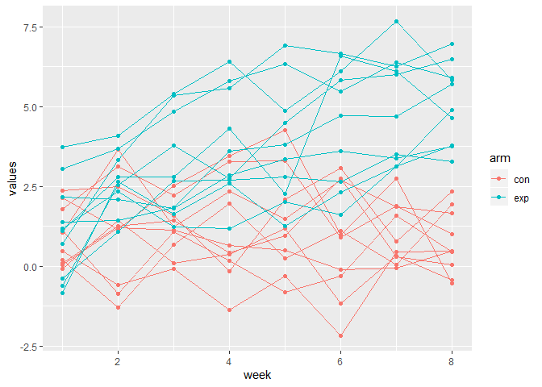

p8105\_hw5\_dd2948
================
David DeStephano
November 3, 2019

``` r
set.seed(10)

iris_with_missing = iris %>% 
  map_df(~replace(.x, sample(1:150, 20), NA)) %>%
  mutate(Species = as.character(Species))
```

Problem 1
---------

``` r
set_missing <- function(x) {
  if(is.numeric(x)){
    #x = replace_na(x, round(mean(x, na.rm=TRUE), digits=1))
    x[is.na(x)] <- round(mean(x, na.rm=TRUE))
    return(x)
  }
  else if (is.character(x)) {
    #x = replace_na(x,"virginica")
    x[is.na(x)] <- "virginica"
    return(x)
  }
}

#map(iris_with_missing, set_missing) 
```

ORIGNAL

``` r
head(iris_with_missing)
```

    ## # A tibble: 6 x 5
    ##   Sepal.Length Sepal.Width Petal.Length Petal.Width Species
    ##          <dbl>       <dbl>        <dbl>       <dbl> <chr>  
    ## 1          5.1         3.5          1.4         0.2 setosa 
    ## 2          4.9         3            1.4         0.2 setosa 
    ## 3          4.7         3.2          1.3         0.2 setosa 
    ## 4          4.6         3.1          1.5        NA   setosa 
    ## 5          5           3.6          1.4         0.2 setosa 
    ## 6          5.4         3.9          1.7         0.4 setosa

VS

``` r
iris_no_missing<-map(iris_with_missing, set_missing) %>% as.data.frame()
head(iris_no_missing)
```

    ##   Sepal.Length Sepal.Width Petal.Length Petal.Width Species
    ## 1          5.1         3.5          1.4         0.2  setosa
    ## 2          4.9         3.0          1.4         0.2  setosa
    ## 3          4.7         3.2          1.3         0.2  setosa
    ## 4          4.6         3.1          1.5         1.0  setosa
    ## 5          5.0         3.6          1.4         0.2  setosa
    ## 6          5.4         3.9          1.7         0.4  setosa

Problem 2
---------

``` r
setwd("./hw5_data")
files = list.files()
all<-map(files, read_csv) %>% 
  bind_rows() %>% 
  mutate(name=files,
         name=str_remove(name,".csv")) %>% 
  separate(name, c('arm', 'subject'), sep="_") %>% 
  select(subject, arm, everything()) %>% 
  pivot_longer(week_1:week_8,
               names_to = "week",
               values_to="values") %>% 
  mutate(week=str_remove(week,"week_"),
         week=as.numeric(week),
         subject=as.numeric(subject))

head(all)
```

    ## # A tibble: 6 x 4
    ##   subject arm    week values
    ##     <dbl> <chr> <dbl>  <dbl>
    ## 1       1 con       1   0.2 
    ## 2       1 con       2  -1.31
    ## 3       1 con       3   0.66
    ## 4       1 con       4   1.96
    ## 5       1 con       5   0.23
    ## 6       1 con       6   1.09

Spaghetti plot

``` r
all %>% ggplot(aes(x = week, y = values,  group=interaction(subject, arm), color = arm)) +
  geom_line() +
  geom_point()+ 
  viridis::scale_fill_viridis(discrete = TRUE)
```


