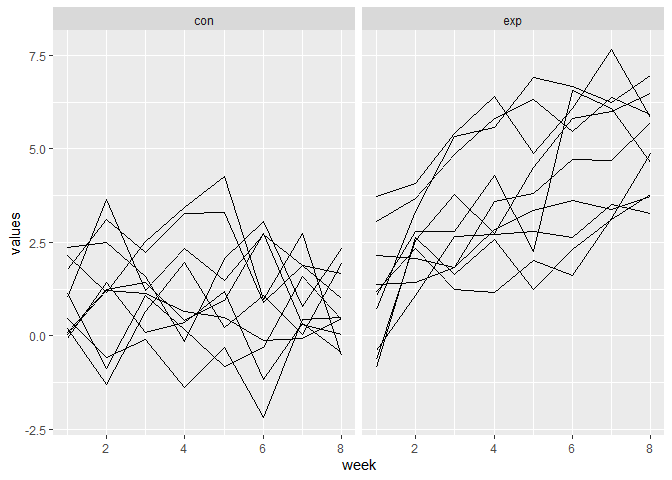
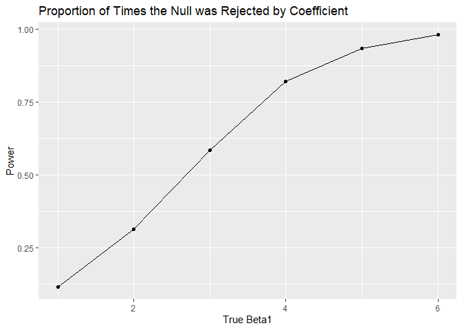
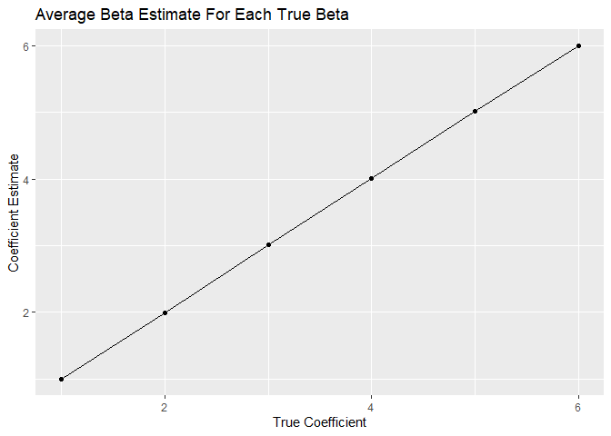
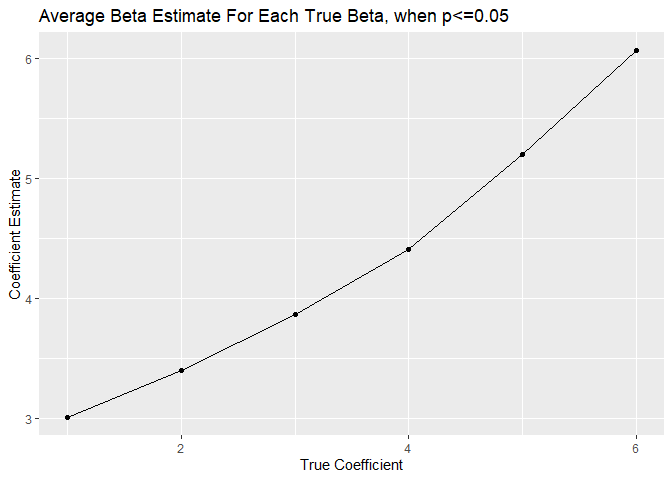

p8105\_hw5\_dd2948
================
David DeStephano
November 3, 2019

``` r
set.seed(10)

iris_with_missing = iris %>% 
  map_df(~replace(.x, sample(1:150, 20), NA)) %>%
  mutate(Species = as.character(Species))
```

Problem 1
---------

``` r
set_missing <- function(x) {
  if(is.numeric(x)){
    #x = replace_na(x, round(mean(x, na.rm=TRUE), digits=1))
    x[is.na(x)] <- round(mean(x, na.rm=TRUE))
    return(x)
  }
  else if (is.character(x)) {
    #x = replace_na(x,"virginica")
    x[is.na(x)] <- "virginica"
    return(x)
  }
}

#map(iris_with_missing, set_missing) 
```

ORIGNAL

``` r
head(iris_with_missing)
```

    ## # A tibble: 6 x 5
    ##   Sepal.Length Sepal.Width Petal.Length Petal.Width Species
    ##          <dbl>       <dbl>        <dbl>       <dbl> <chr>  
    ## 1          5.1         3.5          1.4         0.2 setosa 
    ## 2          4.9         3            1.4         0.2 setosa 
    ## 3          4.7         3.2          1.3         0.2 setosa 
    ## 4          4.6         3.1          1.5        NA   setosa 
    ## 5          5           3.6          1.4         0.2 setosa 
    ## 6          5.4         3.9          1.7         0.4 setosa

VS

``` r
iris_no_missing<-map(iris_with_missing, set_missing) %>% as.data.frame()
head(iris_no_missing)
```

    ##   Sepal.Length Sepal.Width Petal.Length Petal.Width Species
    ## 1          5.1         3.5          1.4         0.2  setosa
    ## 2          4.9         3.0          1.4         0.2  setosa
    ## 3          4.7         3.2          1.3         0.2  setosa
    ## 4          4.6         3.1          1.5         1.0  setosa
    ## 5          5.0         3.6          1.4         0.2  setosa
    ## 6          5.4         3.9          1.7         0.4  setosa

Problem 2
---------

``` r
setwd("./hw5_data")
files = list.files()
all<-map(files, read_csv) %>% 
  bind_rows() %>% 
  mutate(name=files,
         name=str_remove(name,".csv")) %>% 
  separate(name, c('arm', 'subject'), sep="_") %>% 
  select(subject, arm, everything()) %>% 
  pivot_longer(week_1:week_8,
               names_to = "week",
               values_to="values") %>% 
  mutate(week=str_remove(week,"week_"),
         week=as.numeric(week),
         subject=as.numeric(subject))

head(all)
```

    ## # A tibble: 6 x 4
    ##   subject arm    week values
    ##     <dbl> <chr> <dbl>  <dbl>
    ## 1       1 con       1   0.2 
    ## 2       1 con       2  -1.31
    ## 3       1 con       3   0.66
    ## 4       1 con       4   1.96
    ## 5       1 con       5   0.23
    ## 6       1 con       6   1.09

Spaghetti plot

``` r
all %>% ggplot(aes(x = week, y = values,  group=interaction(subject, arm), color = arm)) +
  geom_line() +
  geom_point()+ 
  viridis::scale_fill_viridis(discrete = TRUE)
```


Panelled:

``` r
all %>%
  ggplot(aes(x = week, y = values, group= subject)）+
  geom_line() + 
    facet_grid(. ~arm)
```

 The control arm and experimental arm start at the about the same baseline at week zero. Participants in the experimental arm have progressively higher values of the response variable over time, while the control arm stays at about the same values over the course of the trial. At the end of the trial (week 8) all the experimental group participants have higher values than the end values of the control group.

Problem 3
=========

``` r
sim_regression <- function(n=30, beta0 = 2, beta1 = 0) {
  
  sim_data = tibble(
    x = rnorm(n, mean = 0, sd = 1),
    y = beta0 + beta1 * x + rnorm(n, 0, sqrt(50))
  )
  
  ls_fit = lm(y ~ x, data = sim_data) %>% 
    broom::tidy() %>% 
    filter(term=="x") %>% 
    select(estimate, p.value)
}


sim_results <- 
  purrr::rerun(10000, sim_regression()) %>% 
  bind_rows()

head(sim_results)
```

    ## # A tibble: 6 x 2
    ##   estimate  p.value
    ##      <dbl>    <dbl>
    ## 1    2.02  0.207   
    ## 2    1.23  0.182   
    ## 3    0.603 0.606   
    ## 4    3.03  0.000149
    ## 5   -1.19  0.471   
    ## 6   -1.49  0.219

Repeat the above for β1={1,2,3,4,5,6}, and make plots

``` r
set.seed(10)
sim_results2 <- 
  tibble(beta1s = c(1:6)) %>% 
  mutate(
    output_lists = map(.x = beta1s, ~rerun(10000, sim_regression(beta1 = .x))),
    estimate_dfs = map(output_lists, bind_rows)) %>% 
  select(-output_lists) %>% 
  unnest(estimate_dfs)
```

### Make a plot showing the proportion of times the null was rejected (the power of the test) on the y axis and the true value of β1 on the x axis. Describe the association between effect size and power.

``` r
sim_results2 %>% 
  mutate(reject = ifelse(p.value<0.05, 1, 0)) %>%
  group_by(beta1s) %>% 
  summarize(proportion=mean(reject)) %>% 
  ggplot(aes(x=beta1s, y=proportion)) + 
  geom_point() +
  geom_line() +
  labs(title = "Proportion of Times the Null was Rejected by Coefficient",
       x="True Beta1",
       y="Power")
```



As the effect size increases (the true beta 1 value), the power of the test increases.

A higher effect sizes make it more likely that we reject the null hypothesis when it is false.

### Make a plot showing the average estimate of β1 on the y axis and the true value of β1 on the x axis.

#### Make a second plot (or overlay on the first) the average estimate of β^1 only in samples for which the null was rejected on the y axis and the true value of β1 on the x axis.

``` r
sim_results2 %>% 
  group_by(beta1s) %>% 
  summarize(avg_beta=mean(estimate)) %>% 
  ggplot(aes(x=beta1s, y=avg_beta)) + 
  geom_point() +
  geom_line() +
  labs(title = "Average Beta Estimate For Each True Beta",
       x="True Coefficient",
       y="Coefficient Estimate")
```



### For rejected nulls

``` r
sim_results2 %>% 
  filter(p.value<=0.05) %>% 
  group_by(beta1s) %>% 
  summarize(avg_beta=mean(estimate)) %>% 
  ggplot(aes(x=beta1s, y=avg_beta)) + 
  geom_point() +
  geom_line() +
  labs(title = "Average Beta Estimate For Each True Beta, when p<=0.05",
       x="True Coefficient",
       y="Coefficient Estimate")
```



For samples that were rejected the average beta1 estimate is larger than the true value. In linear regression, the hypothesis is that the coefficient/beta does not equal zero. To reject the null with a sample size of only 30, the estimated beta must be larger than the true beta for the values that are already close to zero, but approaches the true value for larger true values of beta.

If the true beta is much larger than zero, the estimated value does not need to be much larger than the true value in order to reject the null that the coefficient is equal to zero (as we see with values greater than 3). This is why the estimated values start to converge on the true coefficient values as the true value increases.
